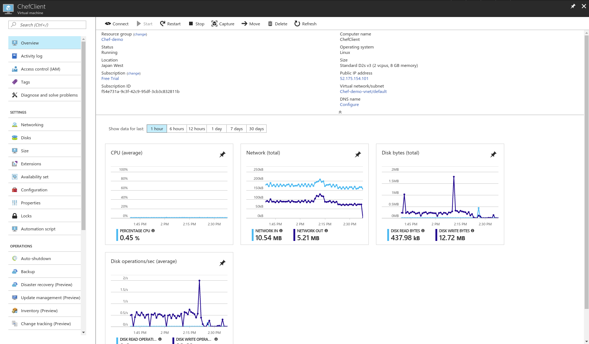

# Chef Demo #

## 1. Setting Chef Server ##

首先要在 [Chaf Manage](https://manage.chef.io/) 註冊新帳號，登入後先下載 configuration 檔案，才能在 workstation 連上 Chef Server 。

### 下載 RSA Private Key ###
進入左邊 User Tab -> 選擇 user 後，按下 reset key 才能得到 private key ，RSA prive key 檔名應為 user.pem ，下載回來之後必須好好保存。


### 下載 Knife.rb ###
進入左邊 Organization Tab -> 選擇 organization 後 -> 按下左邊 tab 中的 Generate Knife Config ，將 knife.rb 下載回來。


## 2. Setting Workstation ##

首先選定資料夾後，產生 Chef-repo

`$ chef generate repo REPO_NAME`

在 chef-repo 中建立新目錄，目錄名稱為 `.chef`

`$ mkdir .chef`

將 knife.rb 與 user.pem 複製進 `.chef` 資料夾後，可使用 `$ knife ssl check` 測試是否連得到 Chef server 。再來要產生 cookbook ，在 cookbooks 目錄中輸入指令產生 cookbook。

`$ chef generate cookbook COOKBOOK_NAME`

進入特定 cookbook 中後，可以產生 recipe

`$ chef generate recipe RECIPE_NAME`

接著就可以編輯 recipe 了。以這個例子來說，我們產生一個 apache server ，我將 cookbook 命名為 web_associated ， recipe 命名為 web_demo ，整個 chef repo 結構應該如下

```
.
├── chefignore
├── cookbooks
│   ├── example
│   │   ├── attributes
│   │   │   └── default.rb
│   │   ├── metadata.rb
│   │   ├── README.md
│   │   └── recipes
│   │       └── default.rb
│   ├── README.md
│   └── web_associated
│       ├── Berksfile
│       ├── chefignore
│       ├── LICENSE
│       ├── metadata.rb
│       ├── README.md
│       ├── recipes
│       │   ├── default.rb
│       │   ├── web_demo.rb
│       │   └── web_destroy.rb
│       ├── spec
│       │   ├── spec_helper.rb
│       │   └── unit
│       │       └── recipes
│       │           ├── default_spec.rb
│       │           ├── web_demo_spec.rb
│       │           └── web_destroy_spec.rb
│       ├── templates
│       │   └── web_example.erb
│       └── test
│           └── smoke
│               └── default
│                   ├── default_test.rb
│                   ├── web_demo_test.rb
│                   └── web_destroy_test.rb
├── data_bags
│   ├── example
│   │   └── example_item.json
│   └── README.md
├── demo2
├── demo2.pub
├── environments
│   ├── example.json
│   └── README.md
├── LICENSE
├── README.md
└── roles
    ├── example.json
    └── README.md
```

而 web_demo.rb 內容為
```ruby
#
# Cookbook:: web_associated
# Recipe:: web_demo
#
# Copyright:: 2017, The Authors, All Rights Reserved.

package 'apache2'

service 'apache2' do
	action [:enable, :start]
end

template '/var/www/html/index.html' do
	source 'web_example.erb'
end
```

這個 demo 中另外使用一個 template ， template 可以在特定 cookbook 中使用 `$ chef generate template TEMPLATE_NAME` 產生。此 template 內容為

```html
<html>
<head>
<body>
Hello World! 11/14
</body>
</head>
</html>
```

## 3. Upload Cookbook ##
回到 Chef-repo 主目錄後，使用 command 上傳 cookbook 至 Chef server ，指令如下

`$ knife cookbook upload COOKBOOK_NAME`

使用`knife cookbook list`可以檢查 cookbook 是否存在。

## 4. Setting Chef Client ###
在這個例子中，我們使用 Azure Cloud ，產生 Virtual Machine ，版本為 Ubuntu Server 14.04 LTS 。大致配置如下



另外要注意的是 Azure 本身的 firewall 也必須做設定，在左邊的 tab 中有一項為 Setting -> Networking ，將 inbound 的 port 8080 & 80 打開。


### 5. Bootstrap Chef Client ###
最後部屬 chef client ， bootstrap 這個指令會對於 client 端做部屬，如果 client 沒有 chef-client 的話會安裝，並把他加進 server 的 node 中，這個指令可以在部署時跑 recipe ，在後面加上 `--run-list` 即可

`$ knife bootstrap IPADRESS -x USER -P PASSWORD --sudo -N NODE --run-list "recipe[COOKBOOK::RECIPE]"`

以這個例子而言我們輸入

`$ knife bootstrap 52.175.154.101 -x tim -P 'PASSWORD*' --sudo -N node1 --run-list "recipe[web_associated::web_demo]"`


## Other Command ##

這個指令可以針對某個 node 增加 run list 要跑的 recipe ，或是指定 role 等等。在 client 端使用 `$ chef-client` 就可以執行 run list 裡的內容。
`knife node run_list add NODE_NAME RUN_LIST_ITEM (options)`

其實 Chef Mange 提供了還不錯的 GUI 介面，建議可以直接使用 GUI 介面管理 node. role. runlist 等等，裝設自己的 Chef server 時也可以一併裝設 Chef Mange 。

---

# Reference #
[Chef 實戰 part5 — 定期自動跑 chef-client 機制]((https://medium.com/verybuy-dev/chef-%E5%AF%A6%E6%88%B0-part5-99ba02a9997achef)

[MiCloud Chef Server Dataset](http://blogger.micloud.tw/2013/04/micloud-chef-server-tutorial.html)
