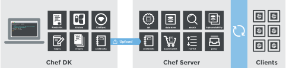

# Chef #

Chef 是一個強大的自動化平台，可以將基礎設施用 code 來編寫、自動化，以達成快速部署環境的目標。三個在 Chef 中的主要角色分別是 **Workstation**. **Chef server**. **Chef client**，其工作流程是 Workstation 將已編寫好的 cookbooks 上傳 Chef server，並讓 Chef server 對 Chef client 端進行自動化部署。



---
# Workstation #

Workstation 為執行 Chef Development Kit (ChefDK) 的機器，主要負責以下三任務：
- 編寫並測試 cookbooks 和 receipts
- 和 Chef server 溝通
- 和 node (Chef client) 溝通

Workstation 中的元件包含
- Knife <br>
command-line tool，其為 chef-repo 和 Chef-server 溝通之介面，除此之外， Knife 幫助使用者管理 nodes, coookbooks, roles, resourece 等各種資訊。
- The Chef-repo　<br>
資料夾結構，存放、編寫、測試 cookbooks 的地方。
- knife.rb <br>
knife 的 configuration。


## Chef-repo ##
<pre><code>
  ├── chefignore
  ├── cookbooks
  │   ├── example
  │   │   ├── attributes
  │   │   │   └── default.rb
  │   │   ├── metadata.rb
  │   │   ├── README.md
  │   │   └── recipes
  │   │       └── default.rb
  │   └── README.md
  ├── data_bags
  │   ├── example
  │   │   └── example_item.json
  │   └── README.md
  ├── environments
  │   ├── example.json
  │   └── README.md
  ├── LICENSE
  ├── README.md
  └── roles
      ├── example.json
      └── README.md
</code></pre>

以上是用`$ chef generate repo REPO_NAME`
所產生之預設的 Chef-repo 結構。

Directory  | Description
---------- | ------------------
`.chef/`     | 隱藏資料夾，存放驗證密鑰 (validation key file) 和 knife.rb.
`cookbooks/` | 存放cookbooks的地方，從supermarket下載的 cookbooks 也存放在這裡。
`data_bags/` | 存放 data bags JSON 檔 (.json)
`environments/` | 從放環境檔 (.rb)/(.json)
`roles/`     | 存放角色 (roles) 定義。 (.rb)/(.json)

> Chef 強烈建議使用 version control system (e.g., git) 來管理 chef-repo。

## Knife ##
Knife 為 chef-repo 和 Chef-server 溝通之介面，常用的幾種情境如：
- Workstation 上傳 cookbooks 時。
- 查看 Chef-server 所管理的 nodes 時。
- 遠端操控 Chef-server 部署 Chef-client 時。
- 上傳/下載 cookbooks 到 supermarket 時。

Knife 的幾種常用指令：

`knife bootstrape` | 遠端部署 chef-client ，並且幫目標安裝 chef-client， bootstrape 必須指定好 IP 位址，或是 FQDN。
------------------ | -----------------
`knife client`     | 管理 client 端指令
`knife configure`  | 產生 knife.rb/client.rb 之指令
`knife cookbook`   | 讓 workstation 與 Chef-server 的 cookbook 互動
`knife cookbook site` | 從 supermarket 下載/上傳 cookbook
`knife data bag`   | 管理 Chef-server 上的 global variables (.json)
`knife delete`     | 刪除 Chef-server 上的 object
`knife deps`       | 確認 nodes, roles, 或 cookbooks 之間的關係
`knife diff`       | 比較 chef-repo 與 Chef-server 之間的差異
`knife download`   | 從 Chef-server 下載 object
`knife upload`     | 上傳 object 到 Chef-server
`knife environment` | 管理 Chef-server 環境
`knife list`       | 列出 Chef-server 的 object，可與 cookbook, environment 等互搭， e.g., `knife cookbook list`. `knife data bag list`. `knife environment list`. `knife node list`. `knife role list`
`knife node`       | 管理 node
`knife role`       | 管理 node 的角色 (role)
`knife ssh`        | 讓 Chef-server 可以使用 SSH command 去管理 nodes
`knife user`       | 管理 user 和他們的 RSA public key-pairs

### Knife plugin ###

- `knife-acl`
- `knife-azure` **important**
- `knife-ec2`
- `knife-eucalyptus`
- `knife-google`
- `knife-linode`
- `knife-lpar`
- `knife-openstack`
- `knife-push`
- `knife-rackspace`
- `knife-vcenter`
- `knife-windows`


## Knife.rb ##
knife.rb 是 Knife 的設定檔，具以下特性：
- 每次執行時都會讀取 knife.rb 。
- 不是默認產生的。
- 默認產生的位置在 `~/.chef/knife.rb` (macOS and Linux platforms) 或 `c:\Users\<username>\.chef` (Windows)，可以用 `--config` option 修改位置。
- 如果 knife.rb 存在的話，就會改寫默認設定。

knife.rb 有可能存在多個地方，Knife 會依照以下順位讀取：
- `--config` 指定的位置
- 目前目錄下的 `.chef` 目錄, e.g., `./.chef/knife.rb`
- 前一目錄下的 `.chef` 目錄, e.g., `../.chef/knife.rb`
- `~/.chef/knife.rb` (macOS or Linux platforms) 或 `c:\Users\<username>\.chef` (Windows)

knife.rb 存放著 template 路徑設定、 Chef-server 的 URL 、 IP. proxy. SSH 等各種設定。

---

# Cookbook #
Cookbook 主要存放數個 recipes ，除此之外， recipes 所需要用到的各種資源，如 Attribute values, Template ， 一個 cookbook 資料夾結構大致如下：

<pre><code>
  ├── attributes
  ├── files
  │   └── default
  ├── metadata.rb
  ├── recipes
  │   └── default.rb
  └── templates
      └── default
</pre></code>

## Recipe ##

Recipe 為 Chef 中主要執行的檔案，類似於腳本檔，能夠自動化所有設定好的動作，以下會示範幾種常用的 Recipe resource。

### Package ###

```ruby
packge "nginx" do
  action :install
  version "<version>"
end
```
Action     | Description
---------- | -------------
`:install` | 安裝（如只輸入 `package "nginx"` ，則預設安裝）
`:purge`   | 移除 package & configuration files
`:reconfig` | 配合 response file 重新設定
`:remove`  | 移除 package
`:upgrade` | 安裝 packge 和/或更新 package 至最新版

>package 這個指令會自動連結到 linux 的套件管理指令，例如 Ubuntu 對應到 apt-get 。

### Directory ###

```ruby
directory "<path>" do
  owner "root"
  group "root"
  mode "0755"
  action :create
end
```

Action     | Description
---------- | -------------
`:create`  | 建立目錄 (default)
`:delete`  | 刪除目錄

### Service ###

```ruby
service "<service name>" do
  action :start
end
```

Action     | Description
---------- | -------------
`:disable` | 停用服務
`:enable`  | 啟用服務
`:reload`  | 重新載入 service configuration
`:start`   | 開始服務
`:stop`    | 停止服務
`:restart` | 重新開始服務

### File ###

```ruby
file "/tmp/something" do
  owner "root"
  group "root"
  mode "0755"
  action :create
```

Action     | Description
---------- | -------------
`:create`  | 新增檔案 (default)，檔案如果存在但不符合 (not match) 時，就重新產生一個檔案覆蓋
`:create_if_missing` | 如果檔案不存在才產生檔案
`:delete`  | 刪除檔案
`:touch`   | 更新檔案被存取和修改的時間 (This updates the access (atime) and file modification (mtime) times for a file.)

### Template ###

```ruby
template "<filename>" do
  source "<file name>.erb"
  mode "0755"
  owner "root"
  group "root"
  variales ({
    :xxx => node[:hello_world][:xxx][:groups],
    :ooo => node[:hello_world][:ooo][:users]
    })
  action :create
end
```
Variable 是輸入 template 之變數。

### Cookbook File ###

```ruby
cookbook_file "<target file name>" do
  path "<source file name>"
  action :create
end
```

### Remote File ###

```ruby
remote_file "#{Chef::Config[:file_cache_path]}/large-file.gz" do
  source "http://www.example.org/large-file.tar.gz"
  action :create
end
```
一般來說，大家在從外部下載檔案進來都是個壓縮檔，或是要執行的檔案，那 Chef 提供了一個方法可以暫存的地方，你可以用 `Chef::Config[:file_cache_path]` 來呼叫它。先暫存在那邊，之後再處理這個 remote file。

### Execute ###

```ruby
exeute "<name>" do
  cwd "<path>"
  command "<command>"
  not_if { ::File.exists?("<file_path>")}
end
```

`cwd` 是 current working directory。
`not_if` 意思是當 condition return `true` 時保護 resource 不被執行。

### Powershell Script ###

```ruby
powershell_script 'name' do
  architecture               Symbol
  code                       String
  command                    String, Array
  convert_boolean_return     TrueClass, FalseClass
  creates                    String
  cwd                        String
  environment                Hash
  flags                      String
  group                      String, Integer
  guard_interpreter          Symbol
  interpreter                String
  notifies                   # see description
  provider                   Chef::Provider::PowershellScript
  returns                    Integer, Array
  subscribes                 # see description
  timeout                    Integer, Float
  user                       String
  password                   String
  domain                     String
  action                     Symbol # defaults to :run if not specified
  elevated                   TrueClass, FalseClass
end
```

### Powershell Package ###

```ruby
powershell_package 'name' do
  package_name               String, Array # defaults to 'name' if not specified
  version                    String, Array
  notifies                   # see description
  subscribes                 # see description
  action                     Symbol # defaults to :install if not specified
end
```

## Attribute ##

Attribute 描述 nodes 的細節，被 Chef-client 用來了解：
- node 目前的狀態 (state)
- node 在前一個 Chef-client 結束執行 (run) 的狀態
- node 在現在的 Chef-client 結束執行的狀態

而 Attribute 被以下幾個元件定義：
- node 本身
- cookbooks (在 attribute files 和/或 recipes )
- 角色 (Role)
- 環境

Attribute 本身會存取以下編號**最大**者：
1. A `default` attribute located in a cookbook attribute file
2. A `default` attribute located in a recipe
4. A `default` attribute located in an environment
4. A `default` ttribute located in a role
5. A `force_default` attribute located in a cookbook attribute file
6. A `force_default` attribute located in a recipe
7. A` normal` attribute located in a cookbook attribute file
8. A `normal` attribute located in a recipe
9. An `override` attribute located in a cookbook attribute file
10. An `override` attribute located in a recipe
11. An `override` attribute located in a role
12. An `override` attribute located in an environment
13. A `force_override` attribute located in a cookbook attribute file
14. A `force_override` attribute located in a recipe
15. An `automatic` attribute identified by Ohai at the start of the chef-client run


### Attribute Example ###
```ruby
default['apache']['dir'] = '/etc/apache2' default['apache']['listen_ports'] = [ '80','443' ]
node.default['apache']['dir'] = '/etc/apache2' node.default['apache']['listen_ports'] = [ '80','443' ]
```
## Template ##

Cookbook templeate 是儲存成 Embedded Ruby (ERB) 檔，可以動態的產生並調整文件。通常儲存在 cookbook 的 `/template` 目錄下。

要使用 template 時，必須滿足兩項條件：
1. template resource 一定有被加進 recipe 中
2. ERB template 一定有被加進 cookbook 中

### Template Example ###

一個 html example
```html
<html>
<body>
<h1>hello world!</h1>
</body>
</html>
```

---

# Other Resource of Chef #
## Data Bag ##

Data bag 是一個全域變數，儲存成 JSON 檔且被 Chef-server 讀取。
用 Knife 產生 data bag:

`$ knife data bag create DATA_BAG_NAME (DATA_BAG_ITEM)`

也可以更新 data bag

`$ knife data bag from file BAG_NAME ITEM_NAME.json`

讀取 data bag

`$ knife data bag from file BAG_NAME ITEM_NAME.json`

預設搜尋路徑為

`data_bags/BAG_NAME/ITEM_NAME.json`

### Data Bag Example ###
```ruby
{
  "id": "mysql",
  "pass": "thesecret123",
  "user": "fred"
}
```

## Role ##

Role 定義屬於單一 job funtion 的 nodes 間的模式 (pattern) 和流程 (process) 。每個 role 都有 0 個或數個 attributes 和 run-list，每個 node 都可以有 0 個或數個 role。

### Role Example ###
```ruby
{
  "name": "client1",
  "chef_environment": "_default",
  "normal": {
    "tags": [

    ]
  },
  "run_list": [
    "role[web_server]"
  ]
}
```

## Environment ##

Environment 對應了工作流程，我們可以透過 Chef-server 設定和管理這個工作流程。

### Environment Example ###
```ruby
{
  "name": "development",
  "description": "The master development branch",
  "cookbook_versions": {
    "nginx": "<= 1.1.0",
    "apt": "= 0.0.1"
  },
  "json_class": "Cheff:Environment",
  "chef_type": "environment",
  "default_attributes": {
  },
  "override_attributes": {
    "nginx": {
      "listen": [
        "80",
        "443"
      ]
    },
    "mysql": {
      "root_pass": "root"
    }
  }
}
```
---
# Reference #
[使用 Chef 自動化部屬一個 Web 服務器 (from IBM)](https://www.ibm.com/developerworks/cn/cloud/library/1506_wangqf_chefforweb/index.html)

[[Rails佈署實戰教學]使用Chef-Solo一鍵安裝機器](https://gogojimmy.net/2013/06/01/Chef-Solo-Basic-with-Vagrant/)

[[Chef] Cookbook 寫 Recipe 常用的 Resource 介紹](http://blog.sammylin.tw/cookbook-resources/)

[[教學]使用Vagrant練習環境佈署](https://gogojimmy.net/2013/05/26/vagrant-tutorial/)
